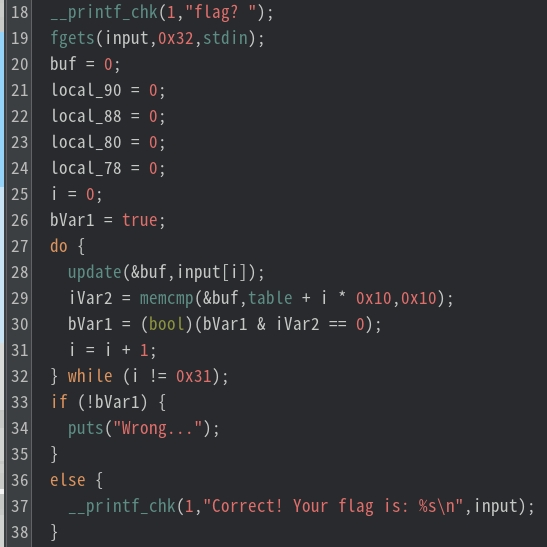

# My solution for Simple_Flag_Checker
実行すると、フラグを尋ねられるいつもどおりのフラグチェッカーのようである。

```
./checker 
flag? Alpaca{hoge}
Wrong...
```

## 静的解析(Ghidra)
Ghidraで解析すると、27行目〜32行目に入力文字列を判定する処理が見つかる。入力を一文字ずつ0x31(49)回のループでチェックしているため、フラグの長さは49文字であると推測できる。



do-while文(27行目〜32行目)の処理を追うと、フラグチェックは以下の流れで行われる。
1. フラグチェックは、入力文字列の一文字ずつに対して行われる
2. `update`により、入力文字に何かしらの処理が行われ、その結果は`buf`がさすアドレスに格納
3. `memcmp`により、**bufにある16バイト**と**table + i*0x10の16バイト**を比較

`update`のデコンパイル結果はハッシュ計算のようなことをしているが、コードの量が多く理解するのは難しいため、何かしらの演算結果が`buf`がさすメモリに格納されると推測した。

`memcmp`により比較されている`table`をGhidraで確認すると、784バイトのデータが確認できる。784/16 = 49であるので、16バイトずつの比較を49回行うということは間違っていなさそうだ。

さて、784バイトのデータから取り出した16バイトに対して、`update`の逆処理を行うことができれば、フラグを求めることができる。しかし、`update`の処理は理解できそうにないし、ハッシュ関数だとすれば逆計算をするのも難しそうである。

そこで、radare2を用いて、１文字ずつブルートフォース的に求めることにした。

## 動的解析(radare2)
radare2でアセンブラを確認する。`memcmp`直後にブレイクポイントを設置し、戻り値(eax)の値を一文字ずつ確認すれば、正しいフラグが求まりそうである。

```
│       ╎   0x00001a1f      4c01ee         add rsi, r13                ; const void *s2
│       ╎   0x00001a22      ba10000000     mov edx, 0x10               ; size_t n
│       ╎   0x00001a27      4889ef         mov rdi, rbp                ; const void *s1
│       ╎   0x00001a2a      e881f6ffff     call sym.imp.memcmp         ; int memcmp(const void *s1, const void *s2, size_t n)                                                             
│       ╎   0x00001a2f      85c0           test eax, eax
```

試しに、`0x1a2f`にブレイクポイントを設置し、`Alpaca{hoge}`を入力し、レジスタ`eax`の値を確認する。すると、一文字目の`A`は正しいため、`eax`の値は0になっている。つまり、この`eax`の値が0になるような文字をブルートフォース的に１文字ずつ求めていけばよい。

```
[0x00001980]> db 0x1a2f
[0x00001980]> ood
[0x7f2ab9380290]> dc
flag? Alpaca{hoge}
INFO: hit breakpoint at: 0x5ad10b491a2f
[0x5ad10b491a2f]> dr eax
0x00000000
```

ちなみに、`memcmp`の引数として渡される`rdi`（buf）と`rsi`（table）が指すメモリを覗いてみると、同じ16バイト（`423c f121 a30f 05ac 57fd 40b0 a214 0198`）が格納されていることが確認できる。

```
[0x5ad10b491a2f]> px/16x @rdi
- offset -      3031 3233 3435 3637 3839 3A3B 3C3D 3E3F  0123456789ABCDEF
0x7ffd11e1c530  423c f121 a30f 05ac 57fd 40b0 a214 0198  B<.!....W.@..... 

[0x5ad10b491a2f]> px @rsi
- offset -      2021 2223 2425 2627 2829 2A2B 2C2D 2E2F  0123456789ABCDEF
0x5ad10b494020  423c f121 a30f 05ac 57fd 40b0 a214 0198  B<.!....W.@.....                    
0x5ad10b494030  7d2e ad5d d623 77c1 067a 50cb f8cd 1dbc  }..].#w..zP.....
0x5ad10b494040  a825 d2dd 9b73 5916 0dad 2822 f910 818a  .%...sY...("....
0x5ad10b494050  5052 38af 804f 15f2 9abd 0665 7598 a27c  PR8..O.....eu..|
0x5ad10b494060  4979 7ed2 dcdb fec1 36a3 aa97 1b00 d232  Iy~.....6......2
0x5ad10b494070  bf81 620a bd10 981c 8cd6 3382 2e93 8946  ..b.......3....F
0x5ad10b494080  0f2e c027 8256 0a1f d4c6 3249 93de 025d  ...'.V....2I...]
0x5ad10b494090  9067 9b06 4ccb 780a 6ff3 9c0e 5e8e 3ad6  .g..L.x.o...^.:.
0x5ad10b4940a0  936f 9ca1 548f c50e 481b 8131 a647 d9e3  .o..T...H..1.G..
0x5ad10b4940b0  c9cd a17e af46 9abc ad1c c8c0 8c9d d916  ...~.F..........
0x5ad10b4940c0  9bd2 2282 35c3 b08f 5a05 5558 45c5 eb67  ..".5...Z.UXE..g
0x5ad10b4940d0  0b17 d6a2 208b 6bb3 1bb8 886f dd0c 1c8f  .... .k....o....
0x5ad10b4940e0  e95e 28b3 054b 529b 83fa ba1a bd5d 7ed5  .^(..KR......]~.
0x5ad10b4940f0  dd95 7f8d 26a0 fb1a e530 adaa 01b7 9e1e  ....&....0......
0x5ad10b494100  10fa ac9c 7257 2a7b e3c6 1b8b edfd 98bf  ....rW*{........
0x5ad10b494110  e14f 5687 7e8f d9ba d65c 794a 4357 0c80  .OV.~....\yJCW..
```

あとは、radare2の機能である`r2pipe`と`rarun2`を用いて、フラグを求める自動化スクリプトを書く。r2pipeにより、radare2のコマンドをpythonから実行でき、さらにコマンドの出力結果を受け取ることもできる。

```python
import r2pipe
import string

flag_len = 49
break_addr = 0x1a2f
known_flag = 'Alpaca{'
program_path = './checker'

def is_correct_letter(current_len, r2):
    for _ in range(current_len):
        r2.cmd("dc")
    eax = int(r2.cmd("dr eax"), 16)

    if eax == 0:
        return True
    else:
        return False

def r2_run_with_stdin(flag):
    profile = """#!/usr/bin/rarun2\nprogram={}\nstdin="{}" """.format(program_path, flag)
    
    with open('profile.rr2', 'w') as f:
        f.write(profile)

    r2 = r2pipe.open(program_path, flags=['-e', 'dbg.profile=profile.rr2', '-2'])
    r2.cmd("db {}".format(break_addr))
    r2.cmd("doo")

    return r2

while len(known_flag) != flag_len:
    found = False

    for letter in string.printable[:-5]:
        current_flag = known_flag + letter
        r = r2_run_with_stdin(current_flag)

        if is_correct_letter(len(current_flag), r):
            known_flag += letter
            print("current flag = {}".format(current_flag))
            found = True
            break

    if not found:
        print("FAILED TO FIND FLAG")
        break

if found:
    print("FLAG FOUND: {}".format(known_flag))
```

実行すると、フラグが求まる。
```
python3 r2-solve.py 
current flag = Alpaca{h
current flag = Alpaca{h4
current flag = Alpaca{h4s
current flag = Alpaca{h4sh
current flag = Alpaca{h4sh_
current flag = Alpaca{h4sh_4
current flag = Alpaca{h4sh_4l
current flag = Alpaca{h4sh_4lg
current flag = Alpaca{h4sh_4lgo
current flag = Alpaca{h4sh_4lgor
current flag = Alpaca{h4sh_4lgor1
current flag = Alpaca{h4sh_4lgor1t
current flag = Alpaca{h4sh_4lgor1th
current flag = Alpaca{h4sh_4lgor1thm
current flag = Alpaca{h4sh_4lgor1thm_
current flag = Alpaca{h4sh_4lgor1thm_1
current flag = Alpaca{h4sh_4lgor1thm_1s
current flag = Alpaca{h4sh_4lgor1thm_1s_
current flag = Alpaca{h4sh_4lgor1thm_1s_b
current flag = Alpaca{h4sh_4lgor1thm_1s_b4
current flag = Alpaca{h4sh_4lgor1thm_1s_b4s
current flag = Alpaca{h4sh_4lgor1thm_1s_b4s3
current flag = Alpaca{h4sh_4lgor1thm_1s_b4s3d
current flag = Alpaca{h4sh_4lgor1thm_1s_b4s3d_
current flag = Alpaca{h4sh_4lgor1thm_1s_b4s3d_0
current flag = Alpaca{h4sh_4lgor1thm_1s_b4s3d_0n
current flag = Alpaca{h4sh_4lgor1thm_1s_b4s3d_0n_
current flag = Alpaca{h4sh_4lgor1thm_1s_b4s3d_0n_M
current flag = Alpaca{h4sh_4lgor1thm_1s_b4s3d_0n_MD
current flag = Alpaca{h4sh_4lgor1thm_1s_b4s3d_0n_MD5
current flag = Alpaca{h4sh_4lgor1thm_1s_b4s3d_0n_MD5_
current flag = Alpaca{h4sh_4lgor1thm_1s_b4s3d_0n_MD5_4
current flag = Alpaca{h4sh_4lgor1thm_1s_b4s3d_0n_MD5_4n
current flag = Alpaca{h4sh_4lgor1thm_1s_b4s3d_0n_MD5_4nd
current flag = Alpaca{h4sh_4lgor1thm_1s_b4s3d_0n_MD5_4nd_
current flag = Alpaca{h4sh_4lgor1thm_1s_b4s3d_0n_MD5_4nd_k
current flag = Alpaca{h4sh_4lgor1thm_1s_b4s3d_0n_MD5_4nd_ke
current flag = Alpaca{h4sh_4lgor1thm_1s_b4s3d_0n_MD5_4nd_kec
current flag = Alpaca{h4sh_4lgor1thm_1s_b4s3d_0n_MD5_4nd_kecc
current flag = Alpaca{h4sh_4lgor1thm_1s_b4s3d_0n_MD5_4nd_kecca
current flag = Alpaca{h4sh_4lgor1thm_1s_b4s3d_0n_MD5_4nd_keccak
current flag = Alpaca{h4sh_4lgor1thm_1s_b4s3d_0n_MD5_4nd_keccak}
FLAG FOUND: Alpaca{h4sh_4lgor1thm_1s_b4s3d_0n_MD5_4nd_keccak}
```